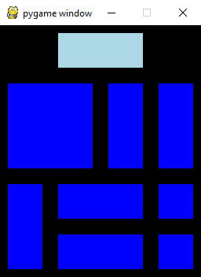

# slider_puzzle

Description:
A slider puzzle containing blocks of various sizes

Goal: 
Move the 2 by 2 block to the bottom left of the board.

Controls:  
left click - select block  
up - move block up  
down - move block down  
left - move block left  
right - move block right

Credits:
Inspired by the sliding block puzzle from PyCon talk - Modern solvers: Problems well-defined are problems solved
http://youtu.be/_GP9OpZPUYc
